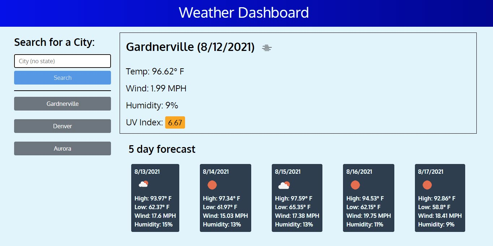
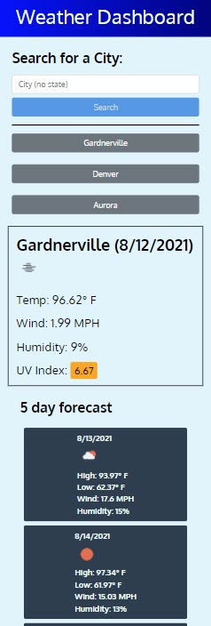

# Weather Dashboard

## Table of Contents

- [Project Description](#project-description)
- [My Comments](#my-comments)
- [User Story](#user-story)
- [Acceptance Criteria](#acceptance-criteria)
- [Usage](#usage)
- [Technologies Used](#technologies-used)
- [Credits](#credits)

## Project Description

Build a weather dashboard that will run in the browser and use ~~Axios and~~ React for the front end.

Use the [OpenWeather One Call API](https://openweathermap.org/api/one-call-api) to retrieve weather data for cities. `localStorage` will be used to store any persistent data.

The original project was fun and not too hard. I wasn't super satisfied with the way the javascript code came out, so I thought I would try it again, only this time using React as the front end. Although we learned Axios in class, we didn't really do much with it, except talk about it. I also have a goal of doing test driven development with this and providing react test cases for this.

Since this is a frontend only application, I will just use GitHub pages to host this application.

## My Comments

### Functionality

So I had started out working on this project after watching [The Net Ninja's _Full Modern React Tutorial_](https://www.youtube.com/playlist?list=PL4cUxeGkcC9gZD-Tvwfod2gaISzfRiP9d). I found the tutorial interesting and it worked well. He talked about hooks and how to load information from a site simply using `fetch`. In his tutorial, he was fetching information from a single site and not including parameters, so he turned the fetch command in to a hook. I thought I could do the same thing for the Weather App. Unfortunately, it didn't work like that.

To use a hook with the URL, the hook must be passed the URL at the time it is setup in the application. The problem I ran into was that the hook couldn't be setup like that for me, because the URL I was passing in was not predetermined. (As I think back, I might have been able to pass a state in to the hook...) I had to pass the search parameters in. I ended up following some of what he did to setup the `useEffect` hook and this allowed me to update parameters as needed.

The other problem I ran in to right away was storing the data and passing it between components. All of the data stemmed from what would be in the `app.js` file. This would be fine for this small of an application. However, I don't think it would scale. I decided that what I needed was to use a store. I set up a context store and stored the data in there. I found a great article from Markus Claus called [Fetching data from an API using React/Redux](https://dev.to/markusclaus/fetching-data-from-an-api-using-reactredux-55ao). Although I wasn't using Redux, the article did give me some good information on the set up of actions and made the `actions.js` file actually useful. He talked about doing these "action creators" which are just simple functions that setup the dispatch:

```javascript
export const GET_SEARCH_CITY = "GET_SEARCH_CITY";
export const getSearchCity = (city) => {
  return {
    type: GET_SEARCH_CITY,
    city: city,
  };
};
```

To me, this made much more sense, and now when I want to getSearchCity, I can just do a `dispatch(getSearchCity(city))` and it will call the reducer and set the variables. He also reminded me of something important about the reducer having pure functions. I was originally going to write the `fetch` function right in the reducer, but that would cause side-effects. So, I followed his advice and set up the gets and called the dispatches at various times within the function.

By using the store, I was also able to control my states better. I realize the problem we ran into on our final homework assignment (Roll for Friendship), was that we weren't controlling our state properly through the store.

### Styling

It took me about a day to recreate the application. I initially used inline coding because I wanted to explore the "component styling".

I started out by doing what we did in class, declaring a constant "styles" adding in the styles I wanted (JS fashion - so camel cased). and then set the style attribute to the styles._tag_. It turns out, from further research, that most people don't consider this component styling - just plain inline styling. That makes sense, because I'm just declaring the style in a variable and plugging the variable in to the attribute.

I first looked at CSS as JSor CSS Modules, this is supposedly built in to React.

```javascript
import styles from "./myStyles.module.css";

function App() {
  return <div className={styles.app}>...</div>;
}
```

I couldn't get this to work it appears that I have to configure webpack and I couldn't find a good tutorial on how to do that AND get it to work. Most of what I was finding was from 2016.

I then tried to use [styled-components](https://styled-components.com/). This is a module that allows writing the style in plain CSS and assigning it to a variable. That variable then becomes the tag for the component using that variable.

```javascript
import styled from "styled-components";

const Content = styled.div`
  max-width: 1320px;
`;

function App() {
  return <Content>...</Content>;
}
```

This turned out to be extremely easy. I just had to import the library at the top of each page and then do the styling. This made the code more readable, because I could be more semantic in the naming conventions of the classes. This also allowed nesting of other items and media queries. This was much like how things worked when I was using React Bootstrap in the project, except that _I_ defined the component.

I was able to refactor the entire app (this including breaking up some components so they were more pure) and fix the styling in about 4 hours. Now my app [mostly] matches that from the homework and is responsive to boot!

## User Story

AS A traveler

I WANT to see the weather outlook for multiple cities

SO THAT I can plan a trip accordingly

## Acceptance Criteria

Here are the critical requirements necessary to develop a portfolio that satisfies a typical hiring manager’s needs:

```
GIVEN a weather dashboard with form inputs

WHEN I search for a city
THEN I am presented with current and future conditions for that city and that city is added to the search history

WHEN I view current weather conditions for that city
THEN I am presented with the city name, the date, an icon representation of weather conditions, the temperature, the humidity, the wind speed, and the UV index

WHEN I view the UV index
THEN I am presented with a color that indicates whether the conditions are favorable, moderate, or severe

WHEN I view future weather conditions for that city
THEN I am presented with a 5-day forecast that displays the date, an icon representation of weather conditions, the temperature, the wind speed, and the humidity

WHEN I click on a city in the search history
THEN I am again presented with current and future conditions for that city (does not reorder based on clicked)

```

## Usage

Completed site's code: [https://github.com/Chip-L/weather-dashboard-react]

Working Page: [https://chip-l.github.io/weather-dashboard-react]

Desktop:



Mobile:



## Technologies Used

- [React](https://reactjs.org/)
- [gh-pages](https://www.npmjs.com/package/gh-pages)
- [dotenv](https://www.npmjs.com/package/dotenv)
- [styled-components](https://styled-components.com/)?

## Credits

- Wikimedia Foundation. (2021, March 13). Ultraviolet index. Wikipedia. https://en.wikipedia.org/wiki/Ultraviolet_index#Index_usage.

- [OpenWeather.org](https://openweathermap.org/)

- Pelling, S. (2021, February 21). Full modern react tutorial. YouTube. https://www.youtube.com/playlist?list=PL4cUxeGkcC9gZD-Tvwfod2gaISzfRiP9d.

- Claus, M. (2019, April 8). Fetching data from an API using REACT/REDUX. DEV Community. https://dev.to/markusclaus/fetching-data-from-an-api-using-reactredux-55ao.

- S., L. (2015, February 5). Styled Components vs. Css Stylesheets. Stream RSS. https://getstream.io/blog/styled-components-vs-css-stylesheets/.

- Khalid, Z. B. (2020, November 3). How to use CSS in React JS with examples. LearnCodeWeb. https://learncodeweb.com/react-js/how-to-use-css-in-react-js-with-examples/.
